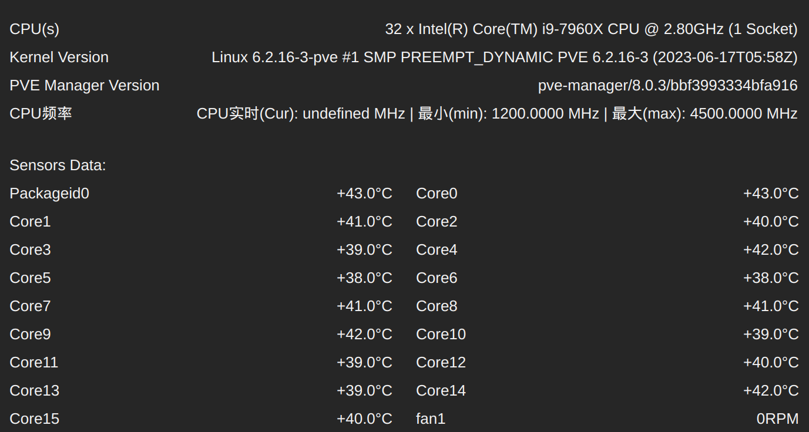

https://github.com/ivanhao/pvetools

## 安装

执行命令：

```go
export LC_ALL=en_US.UTF-8
apt update
apt -y install git 
mkdir -p ~/work/soft
cd ~/work/soft
git clone https://github.com/ivanhao/pvetools.git
```

## 使用

```bash
cd ~/work/soft/pvetools
./pvetools.sh
```

主要用到的功能是：

### ~~配置apt国内源~~

可惜失败了，报错说版本不支持，可能 pve 8 太新还没有来得及更新。只能手工配置了。

### 安装配置 samba 和 nfs

### 安装配置cpu省电

需要设置cpu的最大频率和最小频率，注意单位，比如 4.5G 要设置为 4500000, 0.8g 要设置为 800000.

### 配置PCI硬件直通

### 配置pve的wb界面显示传感器温度/cpu频率

> 注意：不支持最新的 8.0.3，安装时会报错提示版本不匹配。
>
> 但如果是先在 8.0.2 版本下安装之后再升级到 8.0.3，则可以正常使用。
>
> 如果出现页面一直试图显示cpu温度信息，有个圈圈一直在转。修复的方式是先将pve降级，再重新升级回 8.0.3，这个问题就消失了。

这个功能很实用，方便看这些信息了。



### 去除订阅提示


