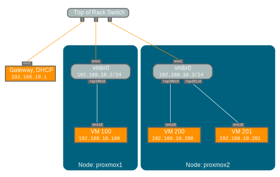

参考：

https://pve.proxmox.com/pve-docs/pve-admin-guide.html#sysadmin_network_configuration

3.3.4. Default Configuration using a Bridge 一节。

## 网桥

网桥就像在软件中实现的物理网络交换机。所有虚拟geust 可以共享单个网桥，也可以创建多个网桥来分隔网络域。每个主机最多可以有 4094 个网桥。



安装程序会创建一个名为 vmbr0 的单个网桥，该网桥连接到第一个以太网卡。/etc/network/interfaces 中的相应配置可能如下所示：

```bash
auto lo
iface lo inet loopback

iface eno1 inet manual

auto vmbr0
iface vmbr0 inet static
        address 192.168.10.2/24
        gateway 192.168.10.1
        bridge-ports eno1
        bridge-stp off
        bridge-fd 0
```

虚拟机的行为就像它们直接连接到物理网络一样。反过来，网络将每个虚拟机视为具有自己的 MAC，即使只有一根网络电缆将所有这些 VM 连接到网络也是如此。
