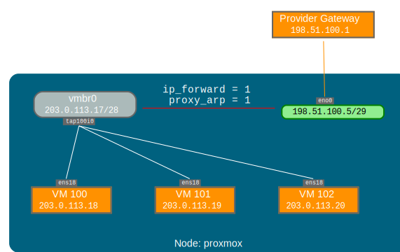

参考：

https://pve.proxmox.com/pve-docs/pve-admin-guide.html#sysadmin_network_configuration

3.3.5. Routed Configuration 一节。

## 路由

大多数托管服务提供商不支持上述设置（网桥）。出于安全原因，一旦在单个接口上检测到多个 MAC 地址，它们就会禁用网络。

可以通过单个接口“路由”所有流量来避免此问题。这可确保所有网络数据包使用相同的 MAC 地址。



一种常见情况是，你有一个公共 IP（在本例中假定为 198.51.100.5），以及一个用于 VM 的额外 IP 块 （203.0.113.16/28）。对于此类情况，我们建议进行以下设置：

```properties
auto lo
iface lo inet loopback

auto eno0
iface eno0 inet static
        address  198.51.100.5/29
        gateway  198.51.100.1
        post-up echo 1 > /proc/sys/net/ipv4/ip_forward
        post-up echo 1 > /proc/sys/net/ipv4/conf/eno0/proxy_arp


auto vmbr0
iface vmbr0 inet static
        address  203.0.113.17/28
        bridge-ports none
        bridge-stp off
        bridge-fd 0
```

