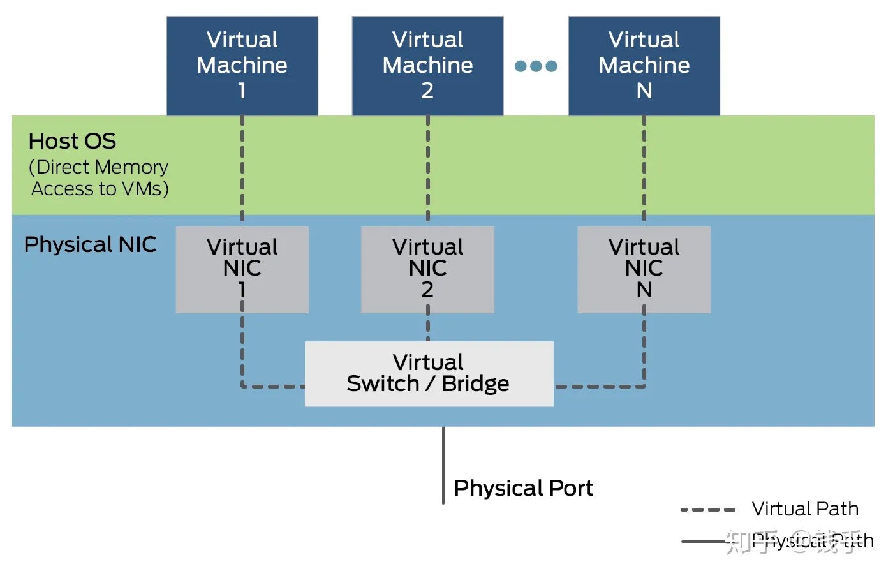
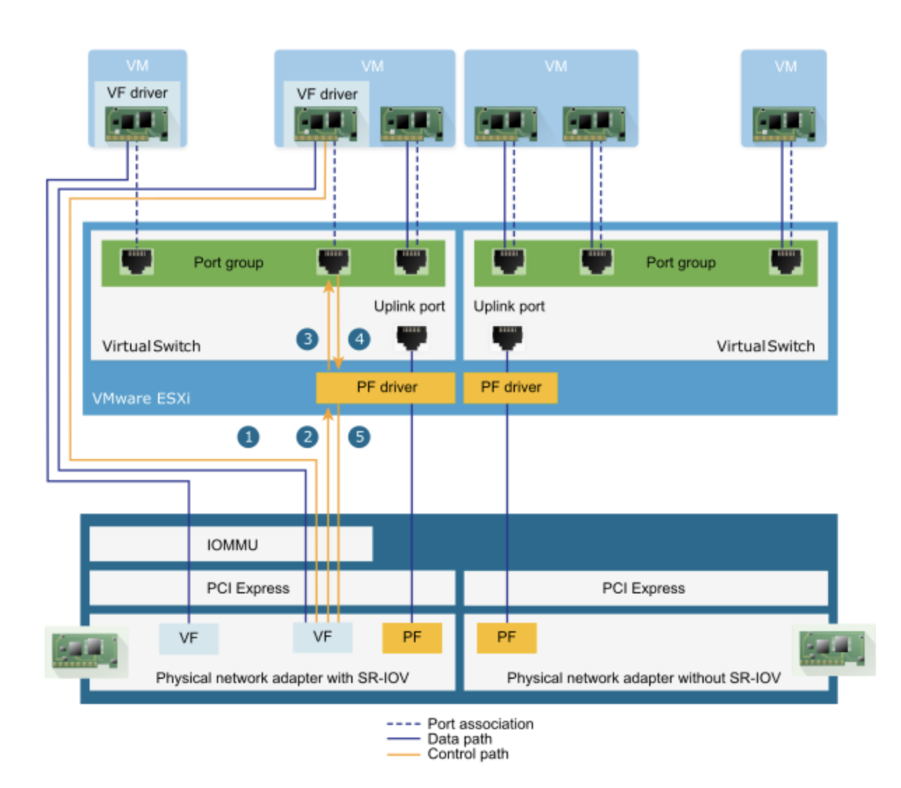

## 介绍

SR-IOV是 "Single Root I/O Virtualization" 的缩写，是 Intel 在 2007年提出的一种基于硬件的虚拟化解决方案。

SR-IOV 规范由 PCI-SIG 在 [http://www.pcisig.com](http://www.pcisig.com/) 上进行定义和维护。

## 原理

虚拟设备有性能和时延的问题，intel VT-D （（Virtualization Technology for Directed I/O）） 可以将 PCIE 物理设备分配给虚拟机，让虚拟机直接控制硬件。

但网卡直通给虚拟机，会造成虚拟机独占网卡所在的PCIE 物理设备，就无法在其他虚拟机中使用这个设备。

为此，Intel 提出 SR-IOV ，将一个物理网卡虚拟出来多个轻量化的 PCIE 物理设备，从而可以分配给虚拟机使用。



SR-IOV 是一种规范，使得单根端口下的单个快速外围组件互连 (PCIe) 物理设备显示为管理程序或客户机操作系统的多个单独的物理设备，既有直通设备的性能优势，又可以支持多个虚拟机，一举两得。



## 优缺点

### 优点 

SR-IOV 是虚拟化的一个重要功能。启用SR-IOV 将大大减轻宿主机的 CPU负荷，提高网络性能，降低网络时延等。

单个 I/O 资源可由许多虚拟机共享。共享的设备将提供专用的资源，并且还使用共享的通用资源。这样，每个虚拟机都可访问唯一的资源。因此，启用了 SR-IOV 并且具有适当的硬件和 OS 支持的 PCIe 设备（例如以太网端口）可以显示为多个单独的物理设备，每个都具有自己的 PCIe 配置空间。

- 性能好
- 减少主机 CPU 消耗

### 缺点

- 虚拟机使用 VF 后无法进行内存超分、快照、热迁移等高级功能
- 配置管理复杂

## 功能类型

SR-IOV 使用 physical functions (PF) 和 virtual functions (VF) 为 SR-IOV 设备管理全局功能。

- PF 包含SR-IOV 功能的完整PCIe设备，PF 作为普通的PCIe 设备被发现、管理和配置 。PF 通过分配VF 来配置和管理 SR-IOV 功能。禁用SR-IOV后，主机将在一个物理网卡上创建一个 PF。
- VF 是轻量级 PCIe 功能（I/O 处理）的 PCIe 设备，每个 VF 都是通过 PF 来生成管理的，VF 的具体数量限制受限于 PCIe 设备自身配置及驱动程序的支持，启用SR-IOV后，主机将在一个物理NIC上创建单个PF和多个VF。 VF的数量取决于配置和驱动程序支持。

> 每个 SR-IOV 设备都可有一个 PF(Physical Functions)，并且每个 PF 最多可有64,000个与其关联的 VF(Virtual Function)。PF 可以通过寄存器创建 VF，这些寄存器设计有专用于此目的的属性。一旦在 PF 中启用了 SR-IOV，就可以通过 PF 的总线、设备和功能编号（路由 ID）访问各个 VF 的 PCI 配置空间。
>
> 每个 VF 都具有一个 PCI 内存空间，用于映射其寄存器集。VF设备驱动程序对寄存器集进行操作以启用其功能，并且显示为实际存在的PCI设备。创建 VF 后，可以直接将其指定给虚拟机或各个应用程序。此功能使得虚拟功能可以共享物理设备，并在没有CPU和虚拟机管理程序软件开销的情况下执行 I/O。

通过下面的命令查看开启 sriov 的 pci 设备，一块设置了 8 个 VF的 ConnectX-3 Pro 网卡：

```bash
lspci -vvv | grep Mellanox
```

输出为：

```bash
81:00.0 Ethernet controller: Mellanox Technologies MT27520 Family [ConnectX-3 Pro]
81:00.1 Ethernet controller: Mellanox Technologies MT27500/MT27520 Family [ConnectX-3/ConnectX-3 Pro Virtual Function]
81:00.2 Ethernet controller: Mellanox Technologies MT27500/MT27520 Family [ConnectX-3/ConnectX-3 Pro Virtual Function]
81:00.3 Ethernet controller: Mellanox Technologies MT27500/MT27520 Family [ConnectX-3/ConnectX-3 Pro Virtual Function]
81:00.4 Ethernet controller: Mellanox Technologies MT27500/MT27520 Family [ConnectX-3/ConnectX-3 Pro Virtual Function]
81:00.5 Ethernet controller: Mellanox Technologies MT27500/MT27520 Family [ConnectX-3/ConnectX-3 Pro Virtual Function]
81:00.6 Ethernet controller: Mellanox Technologies MT27500/MT27520 Family [ConnectX-3/ConnectX-3 Pro Virtual Function]
81:00.7 Ethernet controller: Mellanox Technologies MT27500/MT27520 Family [ConnectX-3/ConnectX-3 Pro Virtual Function]
81:01.0 Ethernet controller: Mellanox Technologies MT27500/MT27520 Family [ConnectX-3/ConnectX-3 Pro Virtual Function]
```


## 参考资料

- [SR-IOV是什么？性能能好到什么程度？](https://zhuanlan.zhihu.com/p/91197211)
- [[SR-IOV 基本概念](https://zdyxry.github.io/2020/03/12/SR-IOV-基本概念/)](https://zdyxry.github.io/2020/03/12/SR-IOV-%E5%9F%BA%E6%9C%AC%E6%A6%82%E5%BF%B5/)
