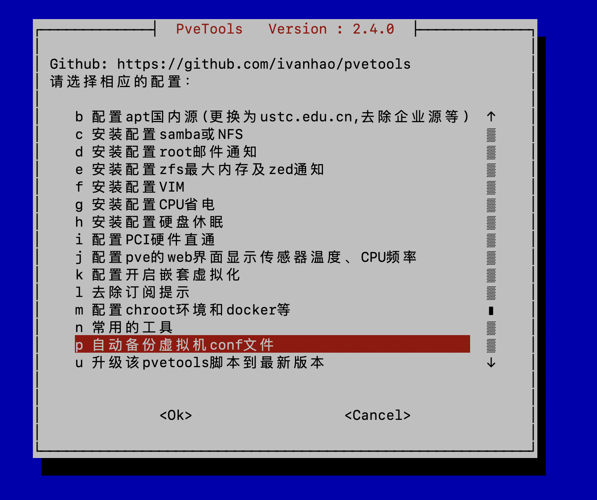
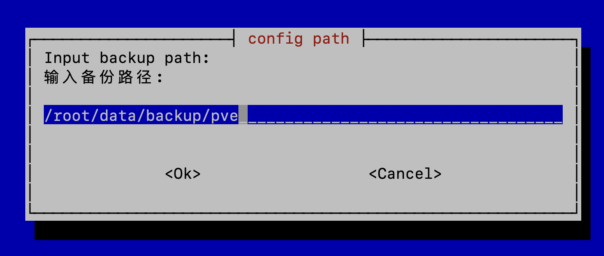

## 准备工作

### 建立备份存放的目录

建立备份存放的目录，为了不被 timeshift 影响，我们将备份目录放到 root 用户的 home 目录（即 /root 目录）。由于在前面 timeshift 设置中的 exclude 中排除了 `/root/**`，因此我们可以将备份目录放到 `/root/**` 下。

```json
  "exclude" : [
    "/var/lib/ceph/**",
    "/var/lib/vz/**",
    "/etc/pve/qemu-server/**",
    "/root/**"
  ],
```

建立备份目录 `/root/data/backup/pve`: 

```bash
mkdir -p /root/data/backup/pve
cd /root/data/backup/pve
```

## 启动虚拟机conf文件备份

通过 pvetools 脚本来启用 "自动备份虚拟机 conf 文件"

```bash
/root/work/soft/pvetools/pvetools.sh
```



输入前面准备的备份路径 `/root/data/backup/pve`



之后虚拟机配置文件就会自动备份到这个目录了。

可以对比一下备份的原始数据和备份后的文件：

- 这是要备份的文件

  ```bash
  $ ls /etc/pve/qemu-server/                       
  1000.conf  1001.conf
  ```

- 这时备份好的目录

  ```bash
  $ ls /root/data/backup/pve/pveConfBackup 
  20240315
  $ ls /root/data/backup/pve/pveConfBackup/20240315 
  1000.conf  1001.conf
  ```

  

## 恢复虚拟机配置文件

在虚拟机配置文件丢失的情况下（典型例子就是用 timeshift restore 功能从备份中恢复），可以通过获取备份的文件来进行恢复。

找到备份的文件：

```bash
$ cd /root/data/backup/pve/pveConfBackup/
$ ls 
20240315
$ cd 20240315                            
$ ls                      
1000.conf  1001.conf
```

复制到 /etc/pve/qemu-server/ 目录：

```bash
rm /etc/pve/qemu-server/*
cp /root/data/backup/pve/pveConfBackup/20240315/* /etc/pve/qemu-server/
```

