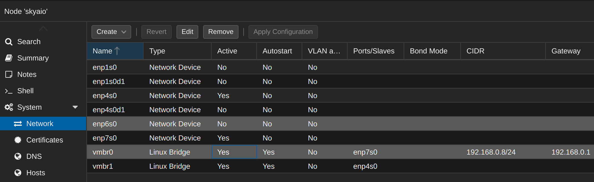
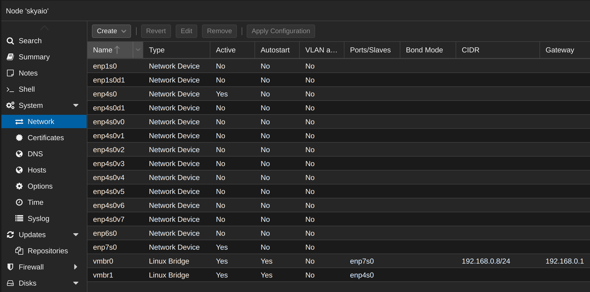
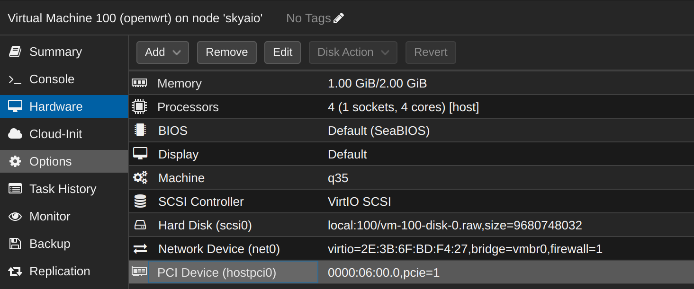
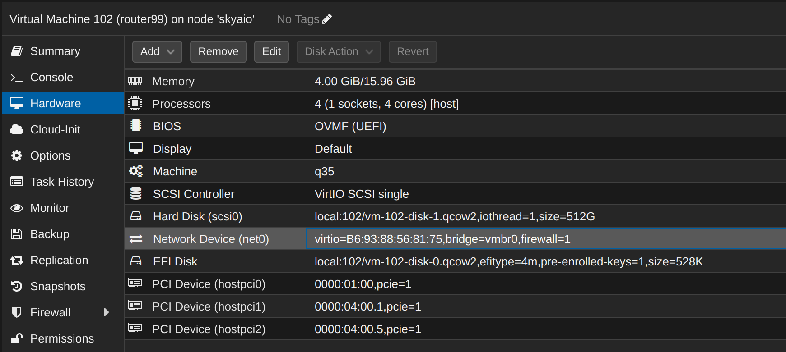
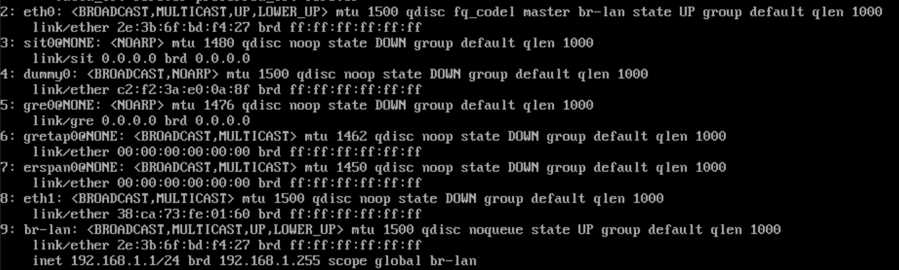
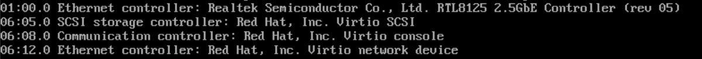
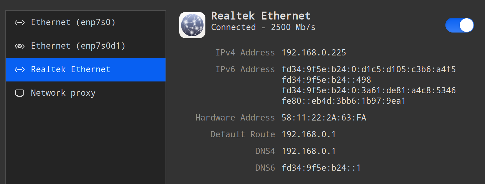
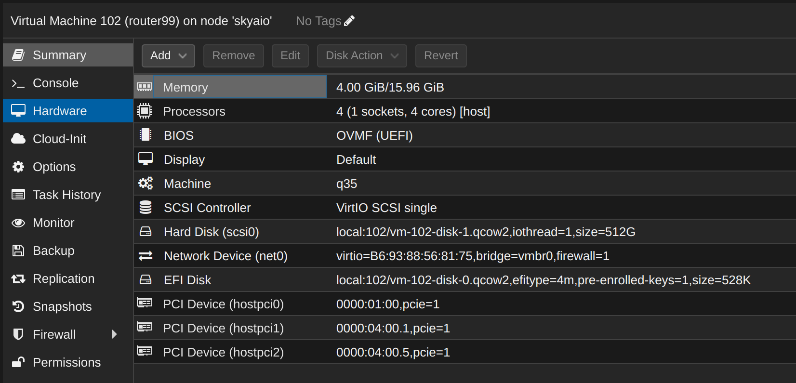
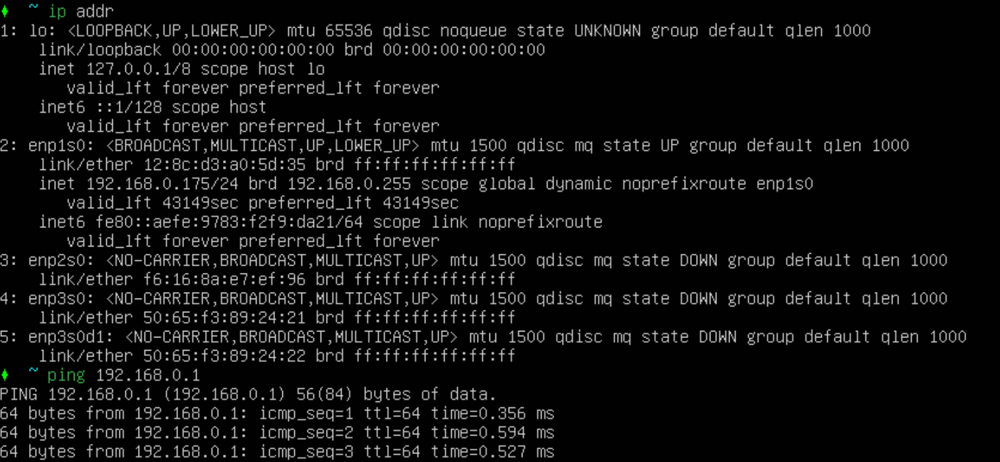
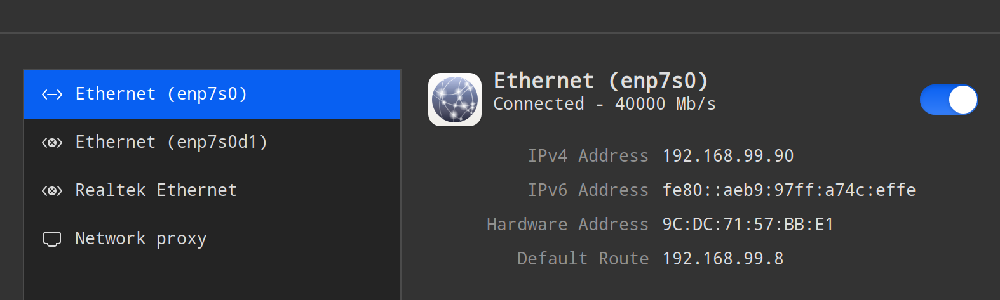

## 背景

需求：

- 在 pve 中搭建 openwrt 的虚拟机，实现软路由功能
- 在 pve 中搭建 ubuntu server 的虚拟机，实现软交换功能

设备：

- 两块 2.5G 网卡，型号为 realtek 8125b，单口
- 两块 40G 网卡，型号为 HP544+，双口

目标：

- openwrt 能实现拨号上网的功能
- openwrt 能提供 DHCP 服务
- 40G 网卡能组建一个高速子网（这是下一个实战的内容），并且开启 RDMA 功能以保证速度和性能
- pve 机器上的其他虚拟机可以自如的访问 40g 和 2.5G 网络

规划：

- 两块 2.5g 网卡，分别用于 openwrt 的 wan 和 lan
  - 其中 lan 会接入 2.5G 交换机，为内网其他设备提供网络服务
  - wan 接入 2.5G 光猫，实现拨号上网

- 两块 40G 网卡
  - 一块 40G 网卡 将完全直通给到 ubuntu server 虚拟机，提供两个速度和性能最佳的网口给到下游设备
  - 一块 40G 网卡将开启 SR-IOV，
    - port1 的PF（物理网卡）将以 vmbr 的形式提供 PVE 管理网络
    - port1 和 port2 的第一个 VF 将直通给到 ubuntu server 虚拟机，提供两个速度和性能还不错（比完整直通低，比网桥高）的网口给到下游设备


实现步骤：

1. 先在现有网络中安装 pve 到物理机，实现现有网络作为 pve 的管理网络
2. 安装 openwrt 虚拟机和 ubuntu server 虚拟机
3. 开启 SR-IOV 和 直通，准备必要的 vmbr，然后分别分配给 openwrt 虚拟机和 ubuntu server 虚拟机
4. 配置  openwrt 虚拟机，实现 wan （使用临时网段暂时先接入现有网络）和 lan, DHCP 分配
5. 配置  ubuntu server 虚拟机，实现基于 linux bridge 的软交换功能
6. 修改 pve 的管理网络为使用 40G 高速网络
7. 拆除现有网络，改用 openwrt 拨号并接入内网设备
8. 修改 openwrt 的临时网段为正式网段

解释： 为什么不在 openwrt 中直接管理两块 40G 网卡？

- 最主要的原因是 openwrt 不支持 RDMA, 因此会有非常巨大的性能损失（超出50%）而且cpu消耗非常高
- openwrt 下 40G 网卡 （具体型号为 hp544+）的启用和停用，会影响 openwrt 下的网络命名 （eth0/eth1/eth2等的存在和顺序），而 openwrt 的 lan / wan 是绑定在 eth0 这样的名称上，而不是具体的 mac 地址上。因此如果下有的 40G 网络设备有启动或者停止，而 openwrt 又进行了重启，则会因为eth网卡顺序和名称的变化造成 openwrt 不可用。

## 准备工作

### 准备虚拟机

分别建立两个虚拟机：

1. 用于软路由的 openwrt

   安装的方法参考 https://skyao.net/learning-openwrt/docs/installation/pve/ 

   > 注意: 先不要开启开机自动启动

2. 用于软交换的 ubuntu server 20.04

### 网卡基本情况

```bash
lspci | grep controller
```

可以看到 pci 设备情况：

```bash
01:00.0 Ethernet controller: Mellanox Technologies MT27520 Family [ConnectX-3 Pro]
04:00.0 Ethernet controller: Mellanox Technologies MT27520 Family [ConnectX-3 Pro]
06:00.0 Ethernet controller: Realtek Semiconductor Co., Ltd. RTL8125 2.5GbE Controller (rev 05)
07:00.0 Ethernet controller: Realtek Semiconductor Co., Ltd. RTL8125 2.5GbE Controller (rev 05)
```

四块网卡网卡的设备 id 依次是 01/04/06/07。

对应他们的网络设备名称，执行

```bash
ip addr
```

可以看到：

```bash
2: enp6s0: <BROADCAST,MULTICAST,UP,LOWER_UP> mtu 1500 qdisc pfifo_fast master vmbr0 state UP group default qlen 1000
    link/ether 38:ca:73:fe:01:60 brd ff:ff:ff:ff:ff:ff
3: enp7s0: <BROADCAST,MULTICAST> mtu 1500 qdisc noop state DOWN group default qlen 1000
    link/ether 58:11:22:08:76:ed brd ff:ff:ff:ff:ff:ff
4: enp1s0: <BROADCAST,MULTICAST> mtu 1500 qdisc noop state DOWN group default qlen 1000
    link/ether 50:65:f3:89:24:21 brd ff:ff:ff:ff:ff:ff
5: enp1s0d1: <BROADCAST,MULTICAST> mtu 1500 qdisc noop state DOWN group default qlen 1000
    link/ether 50:65:f3:89:24:22 brd ff:ff:ff:ff:ff:ff
6: enp4s0: <BROADCAST,MULTICAST> mtu 1500 qdisc noop state DOWN group default qlen 1000
    link/ether 50:65:f3:89:b4:61 brd ff:ff:ff:ff:ff:ff
7: enp4s0d1: <BROADCAST,MULTICAST> mtu 1500 qdisc noop state DOWN group default qlen 1000
    link/ether 50:65:f3:89:b4:62 brd ff:ff:ff:ff:ff:ff
......
16: vmbr0: <BROADCAST,MULTICAST,UP,LOWER_UP> mtu 1500 qdisc noqueue state UP group default qlen 1000
    link/ether 38:ca:73:fe:01:60 brd ff:ff:ff:ff:ff:ff
    inet 192.168.0.8/24 scope global vmbr0

```

- enp6s0： 2.5G 网卡，这块卡按照规划是 openwrt 的 wan 口
- enp7s0： 2.5G 网卡，这块卡按照规划是 openwrt 的 lan 口，同时也是 ubuntu server 的 wan 口
- enp1s0 / enp1s0d1： 第一块（离cpu近） 40G 网卡的两个 port ，这个网卡准备直通给到软交换的 ubuntu server 虚拟机
- enp4s0 / enp4s0d1： 第二块 40G 网卡的两个 port ，需要做 SR-IOV,同时用于管理网络/软交换的 ubuntu server 虚拟机/其他虚拟机
- vmbr0: 管理网络使用的网桥，绑定在 enp7s0 上
- 新加 vmbr1：未来管理网络将要使用的网桥，绑定在 enp4s0 上，因此暂时没有设置 ip 地址和网关



### 准备本地机器

需要准备一台本地机器，作为客户端接入到软路由和软交换的两个网段，因此要求这个机器有两块网卡，分别接入这两个网段。

> 实际操作时也可以用两台机器分别接入 2.5G 和 40G 网络。

### 准备网卡的直通和开启SR-IOV

按照前面的做法， 开启 PVE 的直通支持，并将两块 40G 网卡中的第二块（离cpu远的）设置为开启 SR-IOV。注意：第一块 40G 网卡不要开启 SR-IOV。

```bash
lspci | grep controller
```

查看设置完成之后的网卡设备情况（忽略其他设备）：

```bash
......
01:00.0 Ethernet controller: Mellanox Technologies MT27520 Family [ConnectX-3 Pro]
04:00.0 Ethernet controller: Mellanox Technologies MT27520 Family [ConnectX-3 Pro]
04:00.1 Ethernet controller: Mellanox Technologies MT27500/MT27520 Family [ConnectX-3/ConnectX-3 Pro Virtual Function]
04:00.2 Ethernet controller: Mellanox Technologies MT27500/MT27520 Family [ConnectX-3/ConnectX-3 Pro Virtual Function]
04:00.3 Ethernet controller: Mellanox Technologies MT27500/MT27520 Family [ConnectX-3/ConnectX-3 Pro Virtual Function]
04:00.4 Ethernet controller: Mellanox Technologies MT27500/MT27520 Family [ConnectX-3/ConnectX-3 Pro Virtual Function]
04:00.5 Ethernet controller: Mellanox Technologies MT27500/MT27520 Family [ConnectX-3/ConnectX-3 Pro Virtual Function]
04:00.6 Ethernet controller: Mellanox Technologies MT27500/MT27520 Family [ConnectX-3/ConnectX-3 Pro Virtual Function]
04:00.7 Ethernet controller: Mellanox Technologies MT27500/MT27520 Family [ConnectX-3/ConnectX-3 Pro Virtual Function]
04:01.0 Ethernet controller: Mellanox Technologies MT27500/MT27520 Family [ConnectX-3/ConnectX-3 Pro Virtual Function]
06:00.0 Ethernet controller: Realtek Semiconductor Co., Ltd. RTL8125 2.5GbE Controller (rev 05)
07:00.0 Ethernet controller: Realtek Semiconductor Co., Ltd. RTL8125 2.5GbE Controller (rev 05)
```

在 pve 中看到的网络情况：



目前 vmbr0 绑定在 enp7s0 这块 2.5G 网卡上。

### 网段规划和网卡分工

规划有两个网段：

- `192.168.0.0/24`： 这是软路由的目标网段，openwrt 软路由地址为 192.168.0.1，作为 `192.168.0.0/24` 网段的网关
  - 注意，在实施过程时，因为现有网络使用了 `192.168.0.0/24` 网段，因此 openwrt 会先临时使用 `192.168.5.0/24` 网段，待一切完成后，再改为 `192.168.0.0/24` 网段

- `192.168.99.0/24`： 这是软交换的网段，ubuntu server 软路由地址为 192.168.99.1，作为 `192.168.99.0/24` 网段的网关

刚开始时，由其他路由器拨号，pve 主机安装和配置过程中都需要使用到网络，因此安装 pve 时使用 2.5g 网卡 enp7s0 作为 pve 管理网络（绑定到 vmbr0），此时的 ip 地址是 `192.168.0.8`，如上图所示。

vmbr0 以及它绑定的网卡（现在是 2.5G 的 enp7s0）需要扮演三个角色：

1. 作为 lan 接入到软路由 openwrt 中
2. 作为 wan 接入到软交换 ubuntu server 中
3. 作为管理网络接口提供远程管理功能： 这个功能在最后会被基于 enp4s0 的 vmbr1 取代

> 说明: 由于在安装 pve 时 40G高速网段不可用（软交换所在的 pve 还没有安装），因此只能将 vmbr0 绑定 2.5G  网卡。但后续为了速度起见还是会使用 40G 作为管理网络。

给两个虚拟机分别分配网卡。

> 注意: 要先将虚拟机关机再修改硬件配置，否则无法生效，包括重启之后也无法生效，需要停机/删除/再次添加。

这是 openwrt 的虚拟机，除了分配 vmbr0 外，还需要将另外一块 2.5G 网卡直通进入，充当 openwrt 的 wan 和 lan：



切记： 直通网卡时千万不要弄错，别把 pve 的管理网络所在的网卡（也就是vmbr0对应的网卡）给直通进去了，那样会导致管理网络无法使用。只能通过 pve 控制台来进行操作。

ubuntu server 的虚拟机，除了需要将使用 vmbr0 作为 wan 之外，还需要将两块 40G 网卡的四个端口都直通进去，其中第二块网卡开启了 SR-IOV，因此直通的是编号为1和5的两个 VF：



至此虚拟机和网卡就都准备好了，开始正式配置软路由和软交换

## 配置软路由 openwrt

将两块网卡给到 openwrt 虚拟机：

1. 设备id 为 06 的 2.5G 网卡： 直通
2. 设备id 为 07 的 2.5G 网卡： 以 vmbr0 的方式

之后两块2.5G网络将分别作为 wan 和 lan。

### 配置 openwrt 虚拟机

启动 openwrt 虚拟机，此时可以通过管理页面来操作，或者直接在机器的控制台操作。执行：

```bash
ip addr
```

可以看到 eth0 / eth1 两块网卡：



执行

```bash
lspci
```

同样能看到两块网卡：



其中一块是直通的，因此能看到型号 RTL8125。另一块是以 vmbr0 的形式，采用的是 Virtio 模式，因此看到的是 “virtio network device”。

但现在看不出来 eth0 / eth1 和两块网卡之间的对应关系。但有个简单的办法，就是拔掉网线，只保留 vmbr0 对应的网卡有网线，然后就可以通过网卡的 UP 状态来识别了。

修改 openwrt 的  `/etc/config/network` 文件，将 lan 设置为 `eth0`， ipaddr 设置为 `192.168.0.1`。拔掉 wan 口的网线，然后重启 openwrt。

此时，会有两个 192.168.0.1/24 网段： 1. 原有的网络  2. 新的 openwrt 的网络

下面我们要将本地机器接入到新的 openwrt 的网络进行后续操作。

### 本地机器接入软路由网络

此时在本地机器上，连接作为 openwrt  lan 口的 2.5g网卡， 接入 openwrt 的  `192.168.0.0/24` 网段：



此时本地机器就成功的接入了 openwrt 的  `192.168.0.0/24` ，可以通过访问 http://192.168.0.1/ 来管理 openwrt ，也可以通过访问 https://192.168.0.8:8006/ 来操作 pve。

### 启用 openwrt 软路由

在本地机器上打开 http://192.168.0.1/ ，登录进入，执行 openwrt 的各种设置（或者直接倒入之前备份的配置）。

我这里因为之前有备份的配置，因此直接导入。openwrt 会自动重启，之后重新登录。

此时 openwrt 就准备好了，除了 wan 口还没有接入光猫来进行拨号，以及还没有接入内网 2.5g 交换机。

去掉之前使用的路由器，连接 openwrt 的 万口和 光猫，改由 openwrt 拨号。并将 内网 2.5g 交换机接入 opemwrt 的 lan 口。

一切搞定之后，关闭 openwrt, 然后在设置中开启自动启动。再重启 pve 机器，验证一下。

至此 openwrt 软路由完成。


## 搭建软交换

在 ubuntu server 虚拟机上设置网卡，将

- 设备id 为 04 的 40G 网卡的第一个端口的第一个 VF： 

  04:00.1 Ethernet controller: Mellanox Technologies MT27500/MT27520 Family [ConnectX-3/ConnectX-3 Pro Virtual Function]

- 设备id 为 04 的 40G 网卡的第二个端口的第一个 VF： 

  04:00.5 Ethernet controller: Mellanox Technologies MT27500/MT27520 Family [ConnectX-3/ConnectX-3 Pro Virtual Function]

- 设备id 为 01 的 40G 网卡： 整个网卡直通进入，注意不是 VF,这块网卡特意没有开启 SR-IOV



开启 ubuntu server 虚拟机，登录进入后执行

```bash
ip addr
```

可以看到此时 enp1s0 已经自动获取了  `192.168.0.0/24` 网段的地址：



这是因为 enp1s0 是 VF，而另外一个 VF 在前面被我们直通给了 openwrt 主机。两个网段之间的联系（包括和管理网络的联系）就是通过这样的方式建立起来的。

之后按照软交换的设置方式，参考 https://skyao.net/learning-ubuntu-server/docs/switch/


### 切换管理网络为高速网络

在两个虚拟机准备好之后，第一件事情是修改为采用 40G 高速网络进行 pve 管理，以便后续将两块 2.5g 网卡都直通给到 openwrt 的虚拟机。

现在我们要做的是修改 vmbr0 的设置，让它绑定在 enp4s0 这块 40G 网卡的 port1 上。

先将一台电脑的 40G 网卡和 pve 所在机器的这块40G网卡的 port 1 （两个网口中更靠近主板的那个）连接，后续就只能依靠这条网络来远程管理 pve。

更换管理网络的事情最好还是在 pve 机器控制台上进行，因为中途管理网络会中断。

修改 `/etc/network/interfaces` 中 vmbr0 对应的网卡，从原有的 `enp6s0` 修改为 `enp4s0`，然后设置：

- ip地址为 `192.168.99.8`
- 子网掩码为 `255.255.255.0`
- 网关为 `192.168.99.1`: 这个网关现在还不存在，未来将在软交换 ubuntu server 中创建，但不影响现在的使用

然后重启 pve。

### 本地机器接入软交换网络

PVE 重启完成后，设置本地机器的 40G 网卡：

- ip地址为 `192.168.99.90`
- 子网掩码为 `255.255.255.0`
- 网关为 `192.168.99.8`:  目前网关不存在，就只能指定为网线直连的对端的 ip 地址

本地40G网卡连接情况如图所示：



之后通过 https://192.168.99.8:8006/ 就可以访问到 pve 机器的新的管理网络了，后续操作都将在远程进行。
