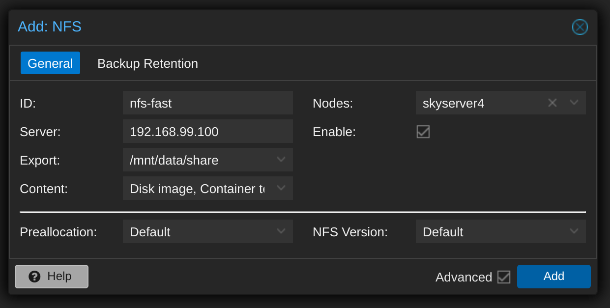
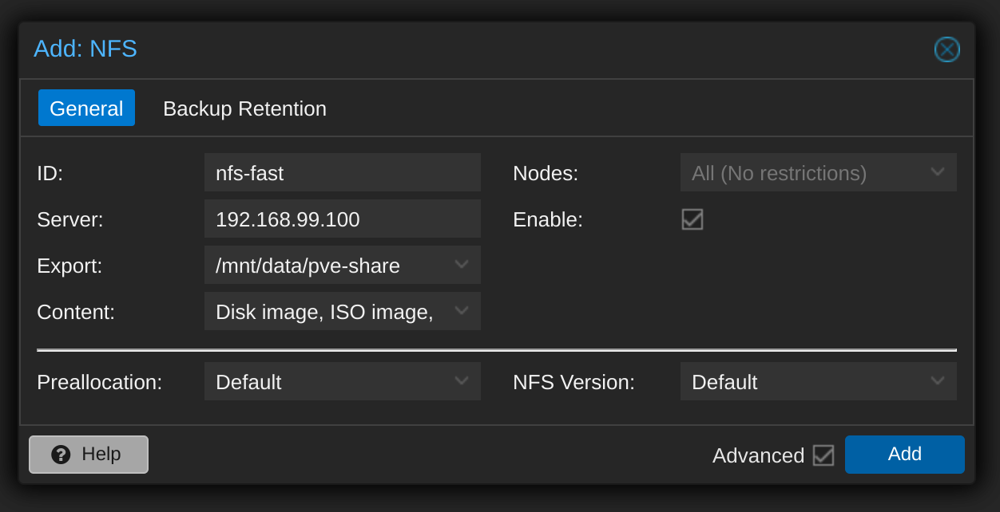

## 标准配置

在 pve 控制页面上打开 Datacenter, 进入 Storge, 在 "Add" 下拉框中选择 "NFS": 



这个方案在正常 pve 集群下没有问题，但是我这里因为机器都是按需启动，不会7x24小时在线，因此 pve 集群的最小法定人数经常无法达到，导致集群不可用。

如果用上面的方案，那么不同机器都会新建 nfs 存储，会导致都指向同一个 nfs 远程目录，这样应该会造成混乱。

## 个人实践（受限不能使用集群功能）

### ID分段使用 nfs 存储

一番尝试之后发现，标准的 nfs 存储只要处理好 ID 分段，不同的 pve 节点使用不同的 ID 范围，就可以正常使用的（前提：有多台 pve 机器又不愿意建立集群）。



建立 nfs 存储的方式和标准方式一样，只是 Content 只选了三个： Disk image, ISO image 和 VZDump backup file。

ID 分段规则：

- local： 从 100 到 999
- nfs-fast： skyserver1-6六台机器，分段分别为 1000-1099 / 2000-2099 / 3000-3099 / 4000-4099 / 5000-5099 / 6000-6099
- template： 10000 开始

### nfs 文件存储位置

#### 服务器端

在 export 文件中，服务器端 export 的目录是 `/mnt/data/pve-share`

```bash
ls
dump  images  template
```

- `template/iso` 目录： 存放上传的 iso 文件
- `dump` 目录： 存放虚拟机和模板的备份文件，可以用于恢复。

#### 客户端

在 pve 页面上用 nfs-fast 为 ID 建立的 nfs 存储，在本地磁盘上挂载的路径为 `/mnt/pve/nfs-fast`

### 共享模板

由于模板是只读的，因此适合跨pve节点共享，但是按照 pve 标准的恢复方式，从 dump 文件恢复后存放在 nfs 存储中的模板虚拟机，只保存在执行恢复操作的这一台 pve 机器上，其他 pve 机器只能在 "VM Disk" 看到这些模板的镜像文件，但是在虚拟机列表中无法列出。

 ssh 登录操作模板恢复的 pve 节点，可以看到恢复的虚拟机模板：

```bash
cd /etc/pve/qemu-server
ls

10000.conf  10001.conf
```

这里遵守前面定制的规则：虚拟机模板的 id 从 10000 开始，确保不会和本地存储上的虚拟机ID重叠。

先把配置文件下载到本地作为备份：

```bash
cd /media/d/backup/pve/qemu-server
scp root@192.168.99.38:/etc/pve/qemu-server/10000.conf /media/d/backup/pve/qemu-server/
scp root@192.168.99.38:/etc/pve/qemu-server/10001.conf /media/d/backup/pve/qemu-server/
```

然后将这些模板的配置文件复制到其他 pve 节点：

```bash
# skyserver
scp /media/d/backup/pve/qemu-server/10000.conf root@192.168.99.18:/etc/pve/qemu-server
scp /media/d/backup/pve/qemu-server/10001.conf root@192.168.99.18:/etc/pve/qemu-server

# skyserver2
scp /media/d/backup/pve/qemu-server/10000.conf root@192.168.99.28:/etc/pve/qemu-server
scp /media/d/backup/pve/qemu-server/10001.conf root@192.168.99.28:/etc/pve/qemu-server

# skyserver4
scp /media/d/backup/pve/qemu-server/10000.conf root@192.168.99.48:/etc/pve/qemu-server
scp /media/d/backup/pve/qemu-server/10001.conf root@192.168.99.48:/etc/pve/qemu-server

# skyserver5
scp /media/d/backup/pve/qemu-server/10000.conf root@192.168.99.58:/etc/pve/qemu-server
scp /media/d/backup/pve/qemu-server/10001.conf root@192.168.99.58:/etc/pve/qemu-server
```

比较麻烦一点的是以后模板文件有变化（增加/修改/删除）时，需要用这个方式手工同步各个 pve 节点机器（毕竟没有集群管理）。

好在模板一般数量有限，更新频率也不会太高，先这么对付着用，不行就写个脚本简化一下操作。

### 模板和虚拟机恢复的最佳实践

实际操作中，有一些发现：

1. 从 dump 出来的备份文件恢复模板，速度是非常快的

   不管是恢复到 nfs 存储还是某台 pve 节点的 local 本地存储，大概一分钟这个级别

2. 从模板文件 clone 到虚拟机，速度非常慢

   恢复 pve 节点的 local 本地存储，大概三五分钟这个级别。

3. clone 时如果选择 “Linked clone”，速度非常快。

   10秒级别， 毕竟这种情况下无需复制整个模板的文件（10-20G级别）

因此，总结出来的最佳实现应该是这样：

1. 坚持以模板为基础来实现虚拟机的备份和版本控制：模板是只读的，对内容的一致性有保障
2. 以pve备份的方式对模板进行备份，得到 dump 文件，用于离线冷备份和不同机器之间分发
3. dump 文件倒入到 nfs 存储中，全局一份
4. 模板默认恢复一份到 nfs 存储中，同样全局只有一份：使用时直接在 nfs 上 “Linked clone”，用完即删
5. 对于使用频率非常高的模板，直接恢复到 pve 节点的 local 本地存储：后续根据使用时间长短区分，长期使用的希望隔离性好的，用 “Full clone”。短期使用用完就删的用 “linked clone”


