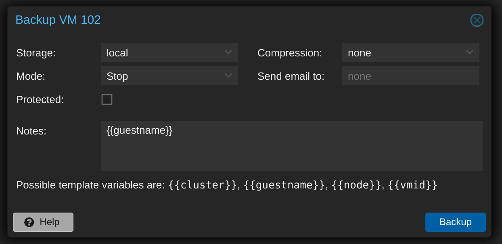
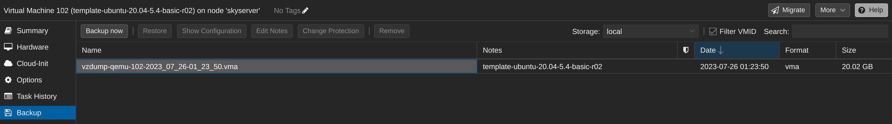
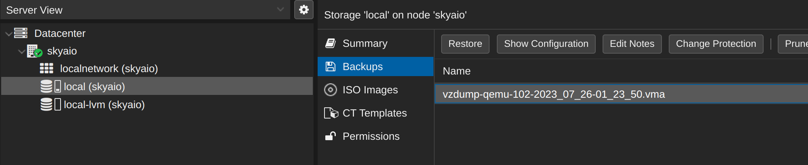
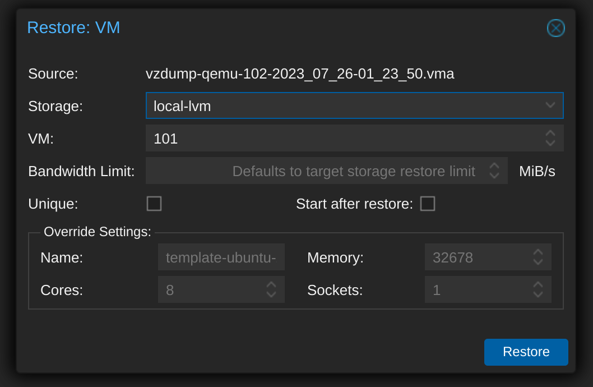
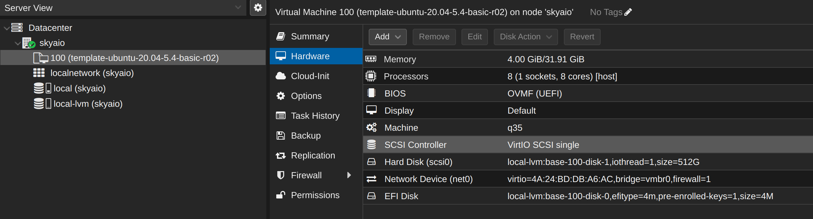

## 背景知识

虚拟机相关的文件一般默认在 `/var/lib/vz/` 下

系统镜像一般在: `/var/lib/vz/template/iso`

备份在web页面操作,备份目录一般在 `/var/lib/vz/dump`


## 使用pve的备份功能

### 备份虚拟机

在 pve 的页面，选择需要备份的虚拟机（或者 template）， “Backup” 选项中，点击 “Backup”。压缩选择 none, mode 选择 stop, 存储选 local，开始备份：



备份过程：

```bash
INFO: starting new backup job: vzdump 102 --storage local --node skyserver --remove 0 --mode stop --compress 0 --notes-template '{{guestname}}'
INFO: Starting Backup of VM 102 (qemu)
INFO: Backup started at 2023-07-26 01:23:50
INFO: status = stopped
INFO: backup mode: stop
INFO: ionice priority: 7
INFO: VM Name: template-ubuntu-20.04-5.4-basic-r02
INFO: include disk 'scsi0' 'nfs:102/base-102-disk-1.qcow2' 512G
INFO: include disk 'efidisk0' 'nfs:102/base-102-disk-0.qcow2' 528K
INFO: creating vzdump archive '/var/lib/vz/dump/vzdump-qemu-102-2023_07_26-01_23_50.vma'
INFO: starting template backup
INFO: /usr/bin/vma create -v -c /var/lib/vz/dump/vzdump-qemu-102-2023_07_26-01_23_50.tmp/qemu-server.conf exec:cat > /var/lib/vz/dump/vzdump-qemu-102-2023_07_26-01_23_50.dat drive-efidisk0=/mnt/pve/nfs/images/102/base-102-disk-0.qcow2 drive-scsi0=/mnt/pve/nfs/images/102/base-102-disk-1.qcow2
INFO: progress 0% 0/549756354560 0
INFO: progress 1% 5500125184/549756354560 4384260096
INFO: progress 2% 10995187712/549756354560 9787478016
INFO: progress 3% 16492740608/549756354560 10499731456
INFO: progress 4% 21993046016/549756354560 15671595008
......
INFO: progress 98% 538762362880/549756354560 520591867904
INFO: progress 99% 544258801664/549756354560 525779709952
INFO: progress 100% 549756354560/549756354560 529814441984
INFO: image drive-efidisk0: size=540672 zeros=49152 saved=491520
INFO: image drive-scsi0: size=549755813888 zeros=529814392832 saved=19941421056
INFO: archive file size: 18.64GB
INFO: adding notes to backup
INFO: Finished Backup of VM 102 (00:01:04)
INFO: Backup finished at 2023-07-26 01:24:54
INFO: Backup job finished successfully
TASK OK
```

备份的结果：



这里可以看到文件名为 `vzdump-qemu-102-2023_07_26-01_23_50.vma`，文件大小为 20.02G。

```bash
ls -lh /var/lib/vz/dump/*.vma
```

可以看到保存的备份文件：

```bash
ls -lh /var/lib/vz/dump/*.vma
-rw-r--r-- 1 root root 19G Jul 26 01:24 /var/lib/vz/dump/vzdump-qemu-102-2023_07_26-01_23_50.vma
```

如果备份时候选择了 zstd 压缩,请后面使用备份文件时要先使用 zstd 解压得到 vma 文件：

```bash
zstd -d vzdump-qemu-102-2023_07_26-01_23_50.vma.zst 
```


### 下载虚拟机文件

通过 scp 等方式将备份文件下载下来：

```bash
scp ./vzdump-qemu-102-2023_07_26-01_23_50.vma sky@192.168.0.240:/media/sky/data/backup/pve
```

通过vma命令转换成raw后缀的磁盘文件

```mipsasm
vma extract vzdump-qemu-103-2023_04_01-13_36_26.vma extract
```

可以通过这样的命令下载整个机器上所有的备份文件到本地磁盘（这里是苹果笔记本上插的移动硬盘）：

```bash
scp root@192.168.20.29:"/var/lib/vz/dump/vzdump-*" /Volumes/u4t/data/backup/pve-backup/skyaio2
```

### 上传虚拟机文件

类似的，将虚拟机备份文件上传到准备做恢复的 pve 上，目标路径同样为 `/var/lib/vz/dump/`

```bash
scp /media/sky/data/backup/pve/vzdump-qemu-102-2023_07_26-01_23_50.vma root@192.168.0.8:/var/lib/vz/dump/
```

如果执行备份和恢复的这两台机器之间可以直通，则可以直接传递备份文件：

```bash
scp /var/lib/vz/dump/vzdump-qemu-107-2023_07_26-02_23_55.vma root@192.168.0.8:/var/lib/vz/dump/
```


### 恢复虚拟机

登录要恢复的 pve, 找到 local 仓库，Backup 子项中已经可以看到刚才上传的的虚拟机备份文件：



点击 “restore”，选择存储：



恢复过程：

```bash
restore vma archive: vma extract -v -r /var/tmp/vzdumptmp24252.fifo /var/lib/vz/dump/vzdump-qemu-102-2023_07_26-01_23_50.vma /var/tmp/vzdumptmp24252
CFG: size: 637 name: qemu-server.conf
DEV: dev_id=1 size: 540672 devname: drive-efidisk0
DEV: dev_id=2 size: 549755813888 devname: drive-scsi0
CTIME: Wed Jul 26 01:23:50 2023
  Rounding up size to full physical extent 4.00 MiB
  Logical volume "vm-100-disk-0" created.
new volume ID is 'local-lvm:vm-100-disk-0'
  WARNING: You have not turned on protection against thin pools running out of space.
  WARNING: Set activation/thin_pool_autoextend_threshold below 100 to trigger automatic extension of thin pools before they get full.
  Logical volume "vm-100-disk-1" created.
  WARNING: Sum of all thin volume sizes (512.00 GiB) exceeds the size of thin pool pve/data and the size of whole volume group (<399.00 GiB).
new volume ID is 'local-lvm:vm-100-disk-1'
map 'drive-efidisk0' to '/dev/pve/vm-100-disk-0' (write zeros = 0)
map 'drive-scsi0' to '/dev/pve/vm-100-disk-1' (write zeros = 0)
progress 1% (read 5497618432 bytes, duration 2 sec)
progress 2% (read 10995171328 bytes, duration 3 sec)
......
progress 99% (read 544258785280 bytes, duration 64 sec)
progress 100% (read 549756338176 bytes, duration 67 sec)
total bytes read 549756403712, sparse bytes 529814392832 (96.4%)
space reduction due to 4K zero blocks 2.65%
rescan volumes...
VM 100 (efidisk0): size of disk 'local-lvm:vm-100-disk-0' updated from 528K to 4M
Convert to template.
  Renamed "vm-100-disk-1" to "base-100-disk-1" in volume group "pve"
  Logical volume pve/base-100-disk-1 changed.
  WARNING: Combining activation change with other commands is not advised.
  Renamed "vm-100-disk-0" to "base-100-disk-0" in volume group "pve"
  Logical volume pve/base-100-disk-0 changed.
  WARNING: Combining activation change with other commands is not advised.
TASK OK
```

恢复完成后的虚拟机：



### 参考资料

- [ProxmoxVE 虚拟机导入导出](https://www.bilibili.com/read/cv12624930/)
- [记录一下最近做的从PVE到ESXi的虚拟机迁移操作](https://www.cnblogs.com/passacaglia/p/17280167.html)

## 通过虚拟磁盘的方式备份