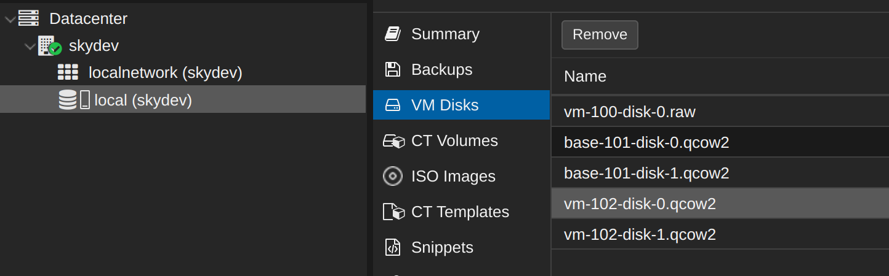
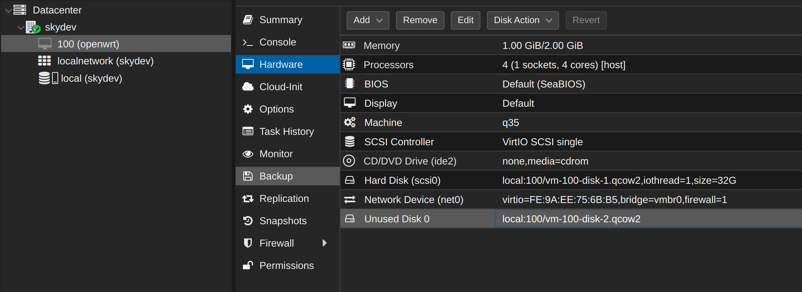

## 背景

由于没有备份虚拟机配置文件，而进行了诸如 timeshift restore 的操作，导致虚拟机配置文件消失，管理页面上看不到虚拟机，而镜像文件残存。



> 备注：后续要做好虚拟机配置文件的备份，配置文件都很小，容易备份和保存。

## 恢复操作

### 查看镜像文件情况

ssh 登录到 pve 主机，执行

```bash
cd /var/lib/vz/images
```

进入虚拟机镜像保存目录，每个虚拟机都在单独的子目录下保存，目录名为 虚拟机id：

```bash
$ ls
100  101  102
```

进入要恢复的虚拟机如 100, 可以看到格式为 raw 的镜像文件。

```bash
$ ls
vm-100-disk-0.raw
```

这是一个 openwrt 的镜像。

### 新建虚拟机

新建一个虚拟机以便稍后倒入镜像文件，这里按照正常的虚拟机创建操作进行即可，磁盘那里可以不用设置，稍后会删除这个磁盘，然后使用倒入的磁盘。

记录新建虚拟机的 id 备用。

### 导入镜像

使用 `qm importdisk ` 命令来进行导入，命令格式为：

```bash
qm importdisk  <vmid> <images-name> <storage pool>  --format=<disk-fs>
```

实际操行的例子：

```bash
qm importdisk 100 ./vm-100-disk-0.raw  local --format=qcow2
```

注意要先创建虚拟机，这个命令的意思是将这个镜像文件导入到目标虚拟机中， 因此目标虚拟机必须先存在。

否则会报错：

```bash
qm importdisk 100 ./vm-100-disk-0.raw  local --format=qcow2
Configuration file 'nodes/skydev/qemu-server/100.conf' does not exist
```

成功执行  `qm importdisk ` 命令的输入为：

```bash
importing disk './vm-100-disk-0.raw' to VM 100 ...
Formatting '/var/lib/vz/images/100/vm-100-disk-2.qcow2', fmt=qcow2 cluster_size=65536 extended_l2=off preallocation=metadata compression_type=zlib size=9680748544 lazy_refcounts=off refcount_bits=16
transferred 0.0 B of 9.0 GiB (0.00%)
transferred 110.8 MiB of 9.0 GiB (1.20%)
......
transferred 8.8 GiB of 9.0 GiB (97.76%)
transferred 8.9 GiB of 9.0 GiB (99.16%)
transferred 9.0 GiB of 9.0 GiB (100.00%)
Successfully imported disk as 'unused0:local:100/vm-100-disk-2.qcow2'
```

### 配置虚拟机

此时在虚拟机 hardware 硬件列表中会出现一个 "unused Disk 0"



选择这个 "unused Disk 0"，点 "edit"，出来的界面中点 "Add"。然后删除创建虚拟机时的那块磁盘。

再修改 "Options" 中的 "Boot Order"，改用新导入的磁盘做启动。

### 启动虚拟机

至此就可以正常的启动虚拟机了。

### 删除旧的镜像文件

这是虚拟机下会有新旧两个虚拟机镜像文件：

```bash
ls /var/lib/vz/images/100
vm-100-disk-0.raw  vm-100-disk-2.qcow2
```

删除旧的这个 `vm-100-disk-0.raw` 文件即可。

## 总结

可以将 pve 的虚拟机理解为是包含两个部分的信息：

1. 虚拟机配置

   配置信息保存在 `/etc/pve/qemu-server` 或者 `/etc/pve/nodes/skydev/qemu-server` 目录下，名为 id.conf 的文件如 100.conf

   备注： `/etc/pve/qemu-server` 是 `/etc/pve/nodes/skydev/qemu-server` 目录 的软链接。

2. 虚拟机镜像

   镜像文件保存在 `/var/lib/vz/images` 目录下，名为 id 的子目录，如 100 文件夹。

前面出现的问题在于 timeshift restore 之后，保存在 `/etc/pve/nodes/skydev/qemu-server` 目录下的配置文件被清理，而保存在 `/var/lib/vz/images` 目录下的镜像文件没有被清理（被设置为 timeshift 的 excludes）。这样虚拟机配置信息没有，而虚拟机镜像文件残存。

上面恢复的过程，可以理解为：

1. 新建一个虚拟机，保全丢失的虚拟机配置信息：因此要尽量按照之前的虚拟机配置进行创建
2. 导入镜像，这是将新的虚拟机配置和残存的虚拟机镜像文件组合起来，形成新的完整的虚拟机。

