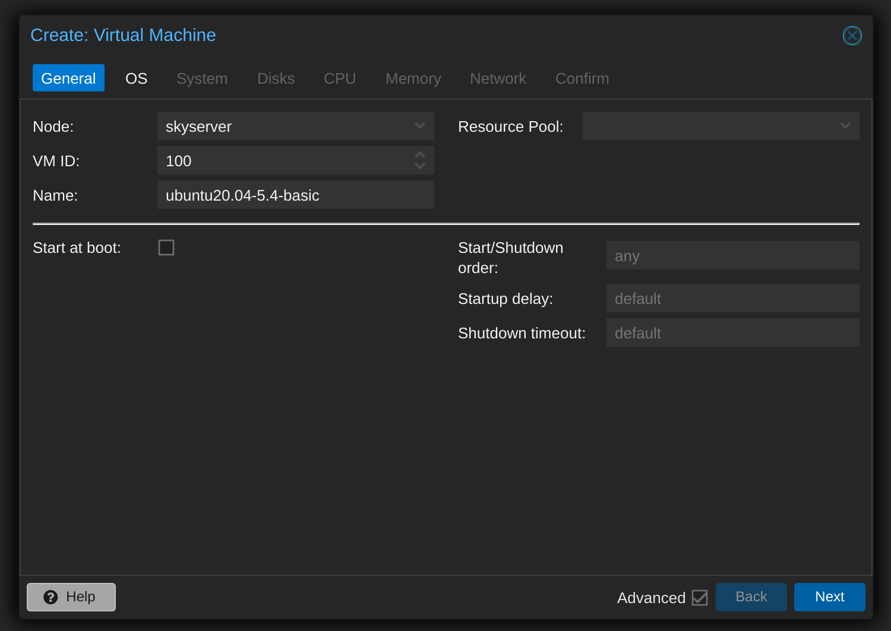
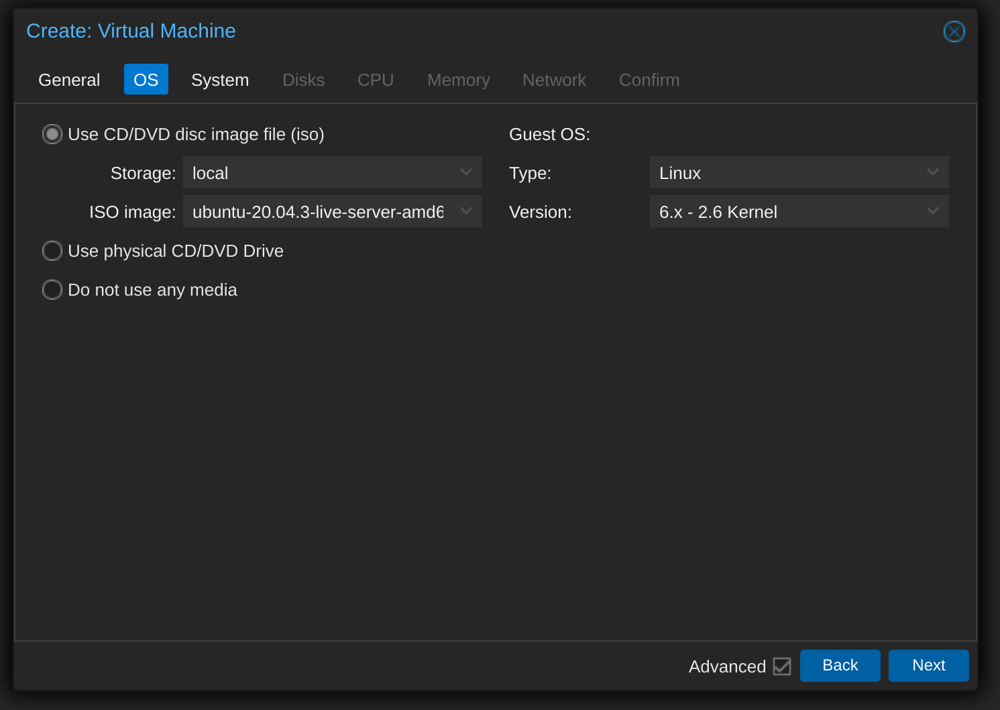
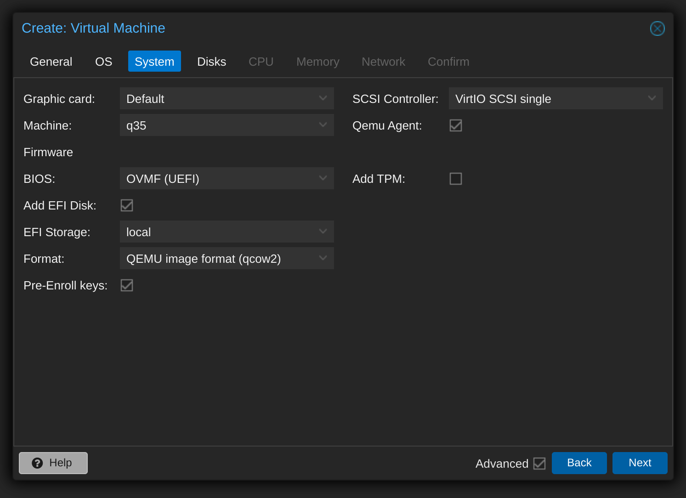
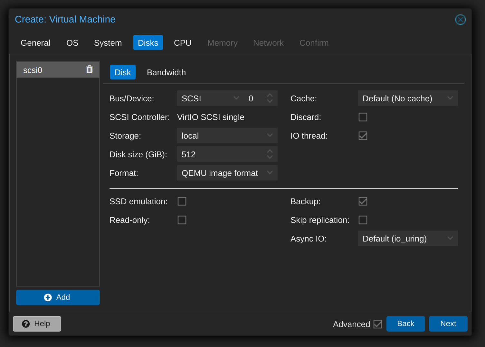
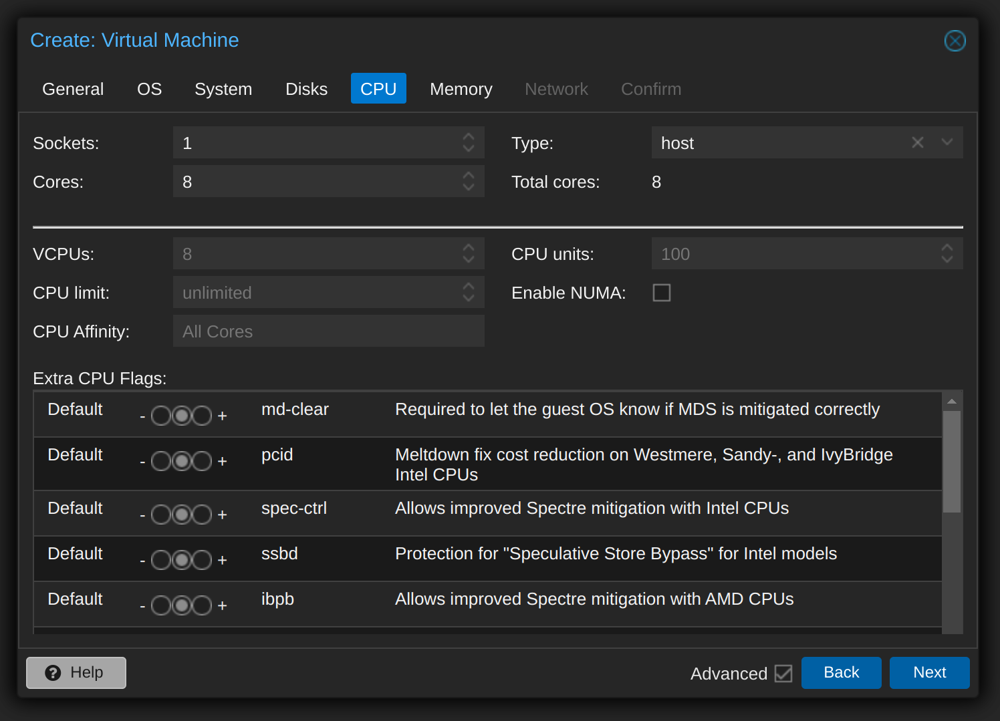
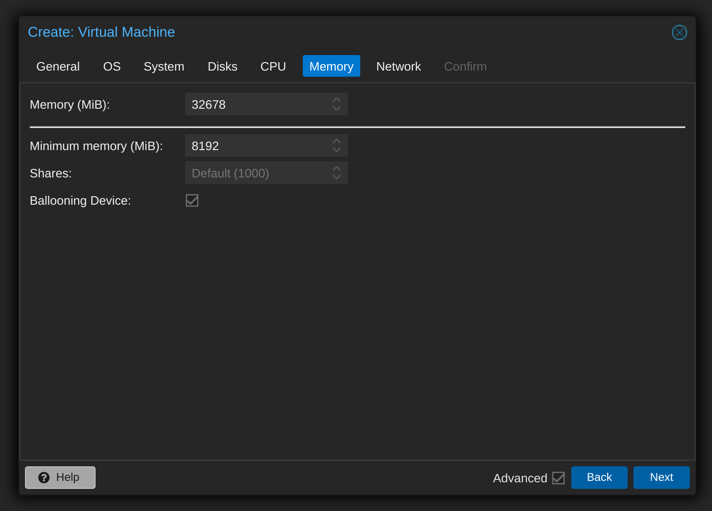
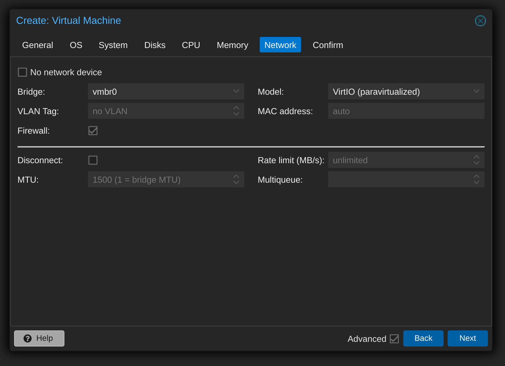

## 相关背景知识

https://pve.proxmox.com/pve-docs/pve-admin-guide.html#chapter_virtual_machines

创建虚拟机的过程有非常多的选项。可以参考：

https://pve.proxmox.com/pve-docs/pve-admin-guide.html#qm_virtual_machines_settings

## 创建虚拟机

### General

VM 的常规设置包括：

- **node** / 节点：将在其上运行虚拟机的物理服务器
- **VM ID**：此 Proxmox VE 安装中用于标识您的 VM 的唯一编号
- **name**：可用于描述 VM 的自由格式文本字符串
- **Resource Pool** / 资源池：虚拟机的逻辑组

### OS

创建虚拟机（VM）时，设置正确的操作系统（OS）允许Proxmox VE优化一些低级参数。例如，Windows操作系统期望BIOS时钟使用本地时间，而基于Unix的操作系统期望BIOS时钟具有UTC时间。

选择需要用到的安装镜像，guest type 和 version 要正确填写。

### System

- machine: q35
- scsi controller: virtIO scsi single
- 勾选 Qemu Agent
- BIOS选 OVMF（UEFI）

> Proxmox VE允许使用不同的固件和机器类型引导VM，即SeaBIOS和OVMF。在大多数情况下，只有当您计划使用 PCIe 直通时，您才希望从默认的 SeaBIOS 切换到 OVMF。虚拟机计算机类型定义虚拟机虚拟主板的硬件布局。您可以在默认的英特尔 440FX 或 Q35 芯片组之间进行选择，后者还提供虚拟 PCIe 总线，因此，如果要通过 PCIe 硬件，则可能需要。

主要是考虑到后面会直通 pcie 网卡到虚拟机。

### Disks

- bus/device： SCSI
- SCSI controller： VirtIO SCSI single
- IO Thread 勾选
- format： QEMU image format

高级选项中：

- 勾选 backup

#### QEMU

QEMU 可以模拟多个存储控制器：

- IDE

  DE控制器的设计可以追溯到1984年的PC/AT磁盘控制器。即使这个控制器已经被最近的设计所取代，你能想到的每个操作系统都支持它，如果你想运行2003年之前发布的操作系统，它是一个不错的选择。您最多可以在此控制器上连接 4 台设备。

- sata

  SATA（串行ATA）控制器可追溯到2003年，具有更现代的设计，允许更高的吞吐量和更多的设备连接。您最多可以在此控制器上连接 6 台设备。

- SCSI

  SCSI控制器设计于1985年，常见于服务器级硬件，最多可连接14个存储设备。Proxmox VE默认模拟LSI 53C895A控制器。

- *VirtIO SCSI single*

  如果您的目标是性能，建议使用  *VirtIO SCSI single* 控制器并为连接的磁盘启用 IO 线程设置。这是自Proxmox VE 7.3以来新创建的Linux VM的默认设置。每个磁盘都有自己的 VirtIO SCSI 控制器，QEMU 将在专用线程中处理磁盘 IO。Linux 发行版从 2012 年开始支持这个控制器，FreeBSD 从 2014 年开始支持。对于 Windows 操作系统，您需要在安装过程中提供包含驱动程序的额外 ISO。

- ~~VirtIO Block~~ 

  VirtIO Block 控制器，通常简称为 VirtIO 或 virtio-blk，是一种较老类型的半虚拟化控制器。在功能方面，它已被 VirtIO SCSI 控制器取代。

考虑到使用的都是高性能的 nvme ssd，因此选择 SCSI + VirtIO SCSI single

#### Image Format 图像格式的说明

> 在每个控制器上，您连接了许多模拟硬盘，这些硬盘由驻留在配置存储中的文件或块设备提供支持。存储类型的选择将决定硬盘映像的格式。提供块设备（LVM，ZFS，Ceph）的存储将需要原始磁盘映像格式，而基于文件的存储（Ext4，NFS，CIFS，GlusterFS）将允许您选择原始磁盘映像格式或QEMU映像格式。

有三个选项：

- **QEMU image format** 

  copy on write 格式，它允许快照和磁盘映像的精简配置。

- **raw disk image**

  硬盘的位到位映像，类似于在 Linux 中的块设备上执行 dd 命令时获得的映像。此格式本身不支持精简配置或快照，需要存储层的合作才能完成这些任务。但是，它可能比 QEMU 图像格式快 10%。

- **VMware image format**

  仅当您打算将磁盘映像导入/导出到其他虚拟机管理程序时，VMware 映像格式才有意义。

#### Cache Mode 缓存模式

设置硬盘驱动器的缓存模式将影响主机系统通知客户机系统块写入完成的方式。无缓存默认值意味着当每个块到达物理存储写入队列时，将通知来宾系统写入已完成，而忽略主机页缓存。这在安全性和速度之间提供了良好的平衡。

#### 高级选项

如果您希望 Proxmox VE 备份管理器在备份 VM 时跳过磁盘，则可以在该磁盘上设置无备份选项。

如果您希望 Proxmox VE 存储复制机制在启动复制作业时跳过磁盘，则可以在该磁盘上设置跳过复制选项。从Proxmox VE 5.0开始，复制要求磁盘映像位于zfspool类型的存储上，因此在VM配置了复制时将磁盘映像添加到其他存储需要跳过此磁盘映像的复制。

### CPU

- type：host （暂时不用担心迁移的问题）
- 对cpu资源暂时不做限制

#### CPU socket

CPU 插槽是 PC 主板上的物理插槽，您可以在其中插入 CPU。然后，此 CPU 可以包含一个或多个内核，这些内核是独立的处理单元。从性能的角度来看，您是具有 4 个内核的单个 CPU 插槽还是两个具有两个内核的 CPU 插槽大多无关紧要。但是，某些软件许可证取决于计算机具有的套接字数，在这种情况下，将套接字数设置为许可证允许您的数量是有意义的。

#### cores

增加虚拟 CPU（内核和插槽）的数量通常会提高性能，但这在很大程度上取决于 VM 的使用。多线程应用程序当然会受益于大量的虚拟CPU，因为对于您添加的每个虚拟CPU，QEMU将在主机系统上创建一个新的执行线程。如果不确定 VM 的工作负荷，通常可以将核心总数设置为 2。

> 如果所有 VM 的核心总数大于服务器上的核心数（例如，在只有 8 个核心的计算机上，4 个 VM 各有 4 个核心（= 总共 16 个），则这是完全安全的。在这种情况下，主机系统将在服务器内核之间平衡 QEMU 执行线程，就像运行标准多线程应用程序一样。但是，Proxmox VE 将阻止您启动具有比物理可用更多的虚拟 CPU 内核的虚拟机，因为这只会由于上下文切换的成本而降低性能。

#### Resource Limits

除了虚拟核心数之外，您还可以配置虚拟机可以获得的资源量（相对于主机 CPU 时间以及与其他虚拟机）相关的资源量。使用 cpulimit（“主机 CPU 时间”）选项，可以限制整个虚拟机在主机上可以使用的 CPU 时间。它是一个浮点值，以百分比表示 CPU 时间，因此 1.0 等于 100%，2.5 到 250%，依此类推。如果单个进程完全使用一个内核，则 CPU 时间使用率为 100%。如果具有四个核心的 VM 完全利用其所有核心，理论上它将使用 400%。实际上，使用率甚至可能更高，因为 QEMU 除了 vCPU 核心线程之外，还可以为 VM 外围设备提供额外的线程。如果 VM 应具有多个 vCPU，此设置非常有用，因为它并行运行几个进程，但整个 VM 不应同时以 100% 的速度运行所有 vCPU。举一个具体的例子：假设我们有一个虚拟机，它将从拥有 8 个 vCPU 中受益，但任何时候这 8 个内核都不应该以满负载运行 - 因为这会使服务器过载，以至于其他虚拟机和 CT 将获得更少的 CPU。因此，我们将 cpulimit 限制设置为 4.0 （=400%）。如果所有内核都执行相同的繁重工作，它们都将获得实际主机内核 CPU 时间的 50%。但是，如果只有 4 个可以工作，他们仍然可以获得几乎 100% 的真实核心。

第二个 CPU 资源限制设置是 CPUUNITS（现在通常称为 CPU 份额或 CPU 权重），用于控制与其他正在运行的 VM 相比，VM 获得的 CPU 时间。它是一个相对权重，默认为 100（如果主机使用旧版 cgroup v1，则为 1024）。如果为 VM 增加此值，则与其他权重较低的 VM 相比，计划程序将优先考虑此值。例如，如果 VM 100 已设置默认值 100，并且 VM 200 更改为 200，则后一个 VM 200 将获得比第一个 VM 100 两倍的 CPU 带宽。

第三个 CPU 资源限制设置“ **affinity**”控制允许虚拟机在哪些主机核心上执行。例如，如果提供的关联值为 0-3，8-11，则虚拟机将限制为使用主机核心 0、1、2、3、8、9、10 和 11。有效的关联性值以 cpuset 列表格式写入。列表格式是以逗号分隔的 CPU 编号和数字范围列表，采用 ASCII 十进制格式。

> 备注：这个如果可行， 似乎可以用来支持 intel 12代/13代 大小核的 CPU,将不关键的虚拟机分配到小核上去运行。待验证。

#### CPU Type

QEMU 可以模拟从 486 到最新至强处理器的许多不同 CPU 类型。每一代新的处理器都增加了新功能，如硬件辅助 3D 渲染、随机数生成、内存保护等。此外，当前一代可以通过带有错误或安全修复的微码更新进行升级。

通常，您应该为虚拟机选择与主机系统的 CPU 非常匹配的处理器类型，因为这意味着主机 CPU 功能（也称为 CPU 标志）将在虚拟机中可用。如果需要完全匹配，可以将 CPU 类型设置为 host，在这种情况下，VM 将具有与主机系统完全相同的 CPU 标志。

不过，这有一个缺点。如果要在不同主机之间实时迁移 VM，则 VM 最终可能会位于具有不同 CPU 类型或不同微码版本的新系统上。如果传递给客户机的 CPU 标志丢失，QEMU 进程将停止。为了解决这个问题，QEMU也有它自己的虚拟CPU类型，Proxmox VE默认使用。

后端默认值为 kvm64，它基本上适用于所有x86_64主机 CPU，创建新虚拟机时的 UI 默认值为 x86-64-v2-AES，这需要从 Westmere 开始的主机 CPU，用于英特尔或至少第四代皓龙用于 AMD。

总之：

- 如果您不关心实时迁移，或者有一个同构集群，其中所有节点具有相同的 CPU 和相同的微码版本，请将 CPU 类型设置为 host，因为理论上这将为您的 guest 提供最大性能。
- 如果您关心实时迁移和安全性，并且只有英特尔 CPU 或只有 AMD CPU，请选择集群的最低代 CPU 型号。
- 如果您关心没有安全性的实时迁移，或者混合了英特尔/AMD 集群，请选择兼容性最低的虚拟 QEMU CPU 类型。

#### NUMA

还可以选择在 VM 中模拟 NUMA 体系结构。NUMA 体系结构的基础知识意味着，内存不是为所有内核提供全局内存池，而是分布到靠近每个插槽的本地库中。这可以带来速度改进，因为内存总线不再是瓶颈。如果您的系统具有 NUMA 体系结构 ，我们建议激活该选项，因为这将允许在主机系统上正确分配虚拟机资源。热插拔 VM 中的核心或 RAM 也需要此选项。

如果使用 NUMA 选项，建议将 socket 数设置为主机系统的节点数。

> 备注： 双路cpu似乎应该设置这个，稍后研究。

### 内存

- Memory: 32678 / 32G
- Minimum memory: 8192 / 8G

对于每个虚拟机，您可以选择设置固定大小的内存或要求Proxmox VE根据主机的当前RAM使用情况动态分配内存。

#### 固定内存分配

将内存和最小内存设置为相同数量时，Proxmox VE将简单地将您指定的内容分配给VM。

即使使用固定的内存大小，ballooning device 也会添加到 VM，因为它提供了有用的信息，例如 guest 实际使用的内存量。通常，您应该启用 ballooning ，但如果您想禁用它（例如用于调试目的），只需取消选中 ballooning device 或在配置中设置balloon: 0

#### 自动内存分配

当将最小内存设置为低于内存时，Proxmox VE将确保您指定的最小内存量始终可用于VM，如果主机上的RAM使用率低于80%，则将动态向 guest 添加内存，直至达到指定的最大内存。

当主机的 RAM 不足时，VM 会释放一些内存回主机，根据需要交换正在运行的进程，并在万不得已的情况下启动 oom 杀手。主机和 guest 之间的内存传递是通过在 guest 内部运行的特殊 ballooning 内核驱动程序完成的，该驱动程序将从主机获取或释放内存页。

当多个虚拟机使用自动分配工具时，可以设置份额 **Shares**  系数，该系数指示每个虚拟机应占用的可用主机内存的相对量。例如，假设您有四个虚拟机，其中三个运行 HTTP 服务器，最后一个是数据库服务器。要在数据库服务器 RAM 中缓存更多数据库块，您希望在备用 RAM 可用时确定数据库 VM 的优先级。为此，将“**Shares** /份额”属性 3000 分配给数据库 VM，将其他 VM 保留为“份额”默认设置 1000。主机服务器有 32GB 的 RAM，当前使用 16GB，剩下 32 * 80/100 - 16 = 9GB RAM 分配给虚拟机。数据库 VM 将获得 9 * 3000 / （3000 + 1000 + 1000 + 1000） = 4.5 GB 额外 RAM，每个 HTTP 服务器将获得 1.5 GB。

2010 年之后发布的所有 Linux 发行版都包含 balloon 内核驱动程序。对于 Windows 操作系统，balloon 驱动程序需要手动添加，并且可能会导致 guest 速度变慢，因此我们不建议在关键系统上使用它。

### 网络

- Model： **VirtIO** paravirtualized NIC

#### Model

每个 VM 可以有多个网络接口控制器 （NIC），有四种不同类型的控制器：

- 英特尔 E1000 

  是默认的，并模拟英特尔千兆位网卡。

- **VirtIO** paravirtualized NIC

  如果您的目标是实现最佳性能，则应使用 VirtIO 半虚拟化 NIC （**VirtIO** paravirtualized NIC）。与所有 VirtIO 设备一样，guest 操作系统应安装正确的驱动程序。

- **Realtek 8139** 

  Realtek 8139 模拟较旧的 100 MB/s 网卡，并且只能在模拟较旧的操作系统时使用（ 2002 年之前发布）

- vmxnet3 

  vmxnet3 是另一个半虚拟化设备，仅在从其他虚拟机管理程序导入虚拟机时应使用。

#### Mac 地址

Proxmox VE 将为每个 NIC 生成一个随机 MAC 地址，以便您的 VM 可在以太网网络上寻址。
