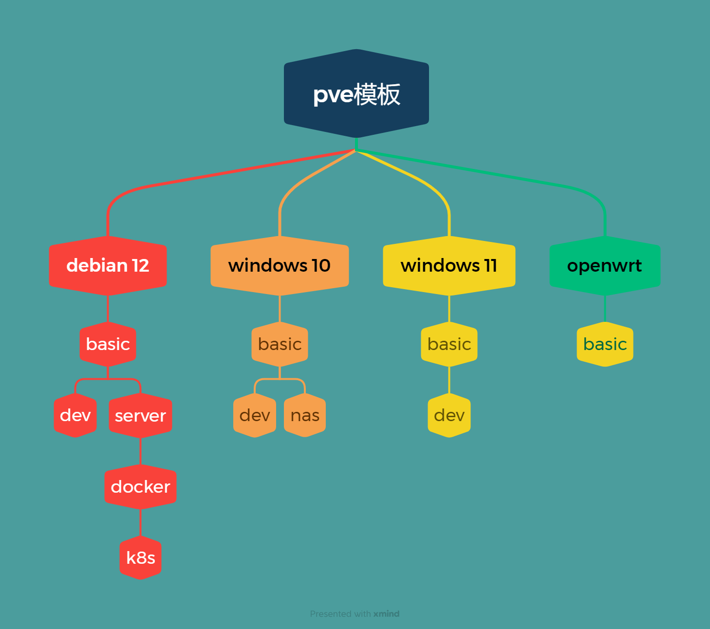

## 模板规划

## 模板维护

### 模板命名

模板命名规则：`template-debian12-basic-v02`

模板命名由四部分组成：

1. 第一部分为固定前缀 template
2. 第二部分为模板操作系统：如 debian12, windows10, windows11，openwrt
   - debian12: debian 12 系列模板
   - windows10: windows 10 系列模板
   - windows11: windows 11 系列模板
   - openwrt: openwrt 系列模板
3. 第三部分为模板类型： 如 basic，dev
   - basic: 基础模板
   - dev: 开发模板
4. 第四部分为模板版本： 如 v01, v02, v03, ...

### 模板编号

模板编号由两部分组成： `0102`

1. 第一部分为模板编号： 

    每个操作系统的模板编号从 01 开始，每个操作系统预留 10到 20 个模板编号，暂时分配如下：

    | 操作系统 | 模板编号 | 备注 |
    | -------- | -------- | -------- |
    | debian12 | 01-19 | 预留20个 |
    | windows10 | 21-29 | 预留10个 |
    | windows11 | 31-39 | 预留10个 |
    | 备用 | 41-79 |  |
    | openwrt | 81-99 | 预留20个，给各种杂项 |

2. 第二部分为模板版本： 如 v01, v02, v03 对应于 01/02/03，最大版本号为 99

### 模板的VM ID

模板的 VM ID 由两部分组成： `990102`

1. 第一部分为模板范围前缀：
   - 99 为全局模板前缀，表示在整个 pve 集群内唯一
   - 19/29/39/119/129 为本地模板前缀，它是为了在本地 pve 机器上加速使用模板而创建，表现为全局模板在本地 pve 机器的副本。同样用 pve 物理机器管理口的 IP 地址。
2. 第二部分为模板编号

简单说，模板编号决定了模板的唯一性，为了加速使用在 VM ID 增加了范围前缀来表明是全局还是本地。

